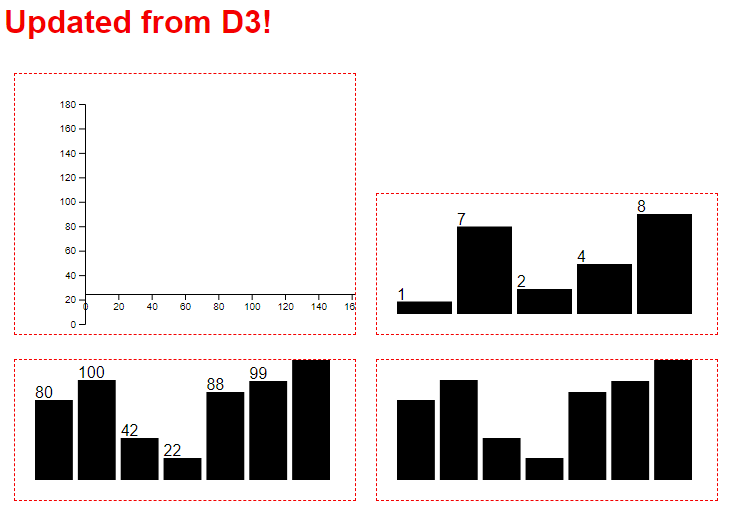
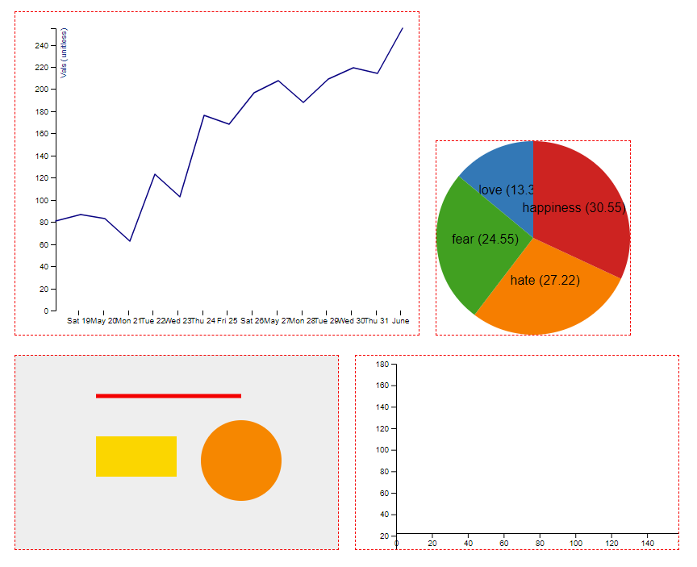

# Experiments with D3JS

This repository contains some personal experiments and tutorial results around D3JS.

## Schedule

These experiments were done over the course of three months in 2018. An overview:

| Week | From         | Until        | Remarks       |
|------|--------------|--------------|---------------|
| 01   | July 2       | July 8       |               |
| 02   | July 9       | July 15      | Vacation!     |
| 03   | July 16      | July 22      |               |
| 04   | July 23      | July 29      |               |
| 05   | July 30      | August 5     |               |
| 06   | August 6     | August 12    | Other project |
| 07   | August 13    | August 19    | Skipped       |
| 08   | August 20    | August 26    | Other project |
| 09   | August 27    | September 2  |               |
| 10   | September 3  | September 9  |               |
| 11   | September 10 | September 16 |               |
| 12   | September 17 | September 23 |               |
| 12   | September 23 | September 30 | Vacation!     |

## Results

Beware, I'm an absolute beginner with D3JS trying to grasp the basics.
For your enjoyment, here are my results.

### Week 01

## Week 02

Vacation!

## Week 03

## Week 04

## Week 05

No screenshots, but [you can read why](week-05)

## Week 06

Skipped, because I was busy with [`sample-angular-oauth2-oidc-with-auth-guards`](https://github.com/jeroenheijmans/sample-angular-oauth2-oidc-with-auth-guards).

## Week 07

Skipped, because of personal reasons.

## Week 08

Skipped, because I was busy with [an OAuth2 Coding Dojo](https://github.com/jeroenheijmans/coding-dojo-implicit-flow).

## Week 09

## Week 10

...
